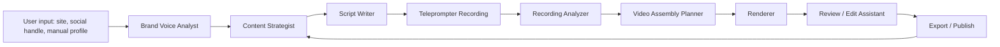

# CoachCast AI Pipeline

## Pipeline Principle

CoachCast should use AI as a controlled production pipeline, not one giant prompt.

Each step should:

- have a clear purpose
- accept structured input
- return structured output
- be saved for debugging
- be testable with examples
- fail safely

This solves the biggest AI product risk: impressive demos that become unpredictable in real use.

## Job Spine

CoachCast stores AI work in `public.ai_jobs` before execution. The first live job slice queues `brand_scan` jobs with:

- `workspace_id`: the tenant boundary
- `created_by`: the authenticated user who requested the scan
- `kind`: `brand_scan`
- `status`: `queued`
- `input.version`: the input contract version
- `input.workspace`: workspace context needed by the scan
- `input.source`: website and Instagram source fields

This gives the product traceability before any model call exists. The protected worker route claims queued jobs, calls the structured brand scan prompt when server-only OpenAI config exists, writes `brand_profiles`, and updates the job to `succeeded` or `failed`.

## Contracting Rules

Every AI job must define these before model execution:

- input contract version
- prompt version
- structured output contract
- validation rules
- eval fixtures for common, edge, and unsafe cases
- persistence mapping into Supabase rows

The current `brand_scan` contract is `brand-scan:v1`. It includes output validation for audience, tone, offers, content pillars, pain points, avoid-claim safety coverage, source confidence, source notes, and uncertainty notes.

## Worker Execution

`POST /api/ai-jobs/brand-scan/run` processes at most one queued `brand_scan` job per request for operator-triggered runs.

`GET /api/ai-jobs/brand-scan/run` supports Vercel Cron and also processes at most one queued `brand_scan` job per request.

The route is intentionally disabled unless all server-only controls exist:

- `AI_WORKER_SECRET`
- `CRON_SECRET` for Vercel Cron invocations
- `SUPABASE_SECRET_KEY`
- `OPENAI_API_KEY`

Callers must send `Authorization: Bearer <AI_WORKER_SECRET>` for manual operator runs or `Authorization: Bearer <CRON_SECRET>` for Vercel Cron runs. The worker does not run from the browser and does not expose provider or service-role secrets.

Production Vercel Cron is configured in `vercel.json` to call the worker once daily at `03:00 UTC`. This is intentionally conservative and compatible with Vercel Hobby plan limits. Move to a more frequent schedule only after the Vercel plan and queue behavior justify it.

The first worker slice uses an optimistic claim: it selects the oldest queued `brand_scan` job, then updates that same row from `queued` to `running`. If another worker claimed it first, this run exits idle. A future database RPC can tighten this with `FOR UPDATE SKIP LOCKED` before high-volume or external beta use.

## Pipeline Overview



## Stage 1: Brand Voice Analyst

### Purpose

Create a reusable profile that every later AI step can rely on.

### Input

```json
{
  "workspaceName": "Fit With Maya",
  "websiteUrl": "https://example.com",
  "socialHandle": "@fitwithmaya",
  "manualNotes": "I help busy women get stronger without extreme diets."
}
```

### Output

```json
{
  "tone": ["direct", "warm", "evidence-informed"],
  "audience": {
    "summary": "Busy adults who want strength and fat loss without intimidation",
    "ageRange": "28-45",
    "experienceLevel": "beginner to intermediate"
  },
  "offers": [
    "1:1 strength coaching",
    "8-week beginner strength program"
  ],
  "contentPillars": [
    "form fixes",
    "myth busting",
    "quick workouts",
    "client wins"
  ],
  "painPoints": [
    "no time",
    "fear of looking silly in the gym",
    "confusion about what to eat",
    "inconsistent motivation"
  ],
  "avoidClaims": [
    "guaranteed weight loss",
    "medical claims",
    "spot reduction promises"
  ]
}
```

### Rationale

Personalization should happen once, then be reused. This reduces prompt cost, keeps output consistent, and avoids rewriting the same context for every script.

### Current Contract

- Input contract version: `1`
- Prompt version: `brand-scan:v1`
- Eval fixtures: independent trainer, multi-trainer gym, unsafe medical positioning, minimal context.
- Execution status: protected worker route, OpenAI adapter, live production validation, and daily Vercel Cron configuration exist; high-volume locking and the remaining AI job kinds are still future work.

## Stage 2: Content Strategist

### Purpose

Generate content ideas that map to the trainer's audience and business goals.

### Input

- Brand profile.
- Goal: leads, authority, education, retention, or transformation.
- Optional content constraints.

### Output

```json
{
  "ideas": [
    {
      "title": "3 Squat Mistakes Beginners Miss",
      "hook": "If your knees cave during squats, stop blaming your knees.",
      "viewerPain": "Bad form and fear of injury",
      "format": "form-fix",
      "cta": "DM SQUAT for a beginner form checklist",
      "confidence": 0.91
    }
  ]
}
```

### Rationale

The user should not start with a blank page. Ideas are the first visible proof that the AI understands the business.

## Stage 3: Script Writer

### Purpose

Turn one idea into a recordable short-form script.

### Input

- Brand profile.
- Selected content idea.
- Desired length.
- Platform.

### Output

```json
{
  "hook": "If your knees cave during squats, stop blaming your knees.",
  "teleprompterText": "If your knees cave during squats, stop blaming your knees. Try this 20-second warmup before your first set...",
  "beats": [
    "Name the problem",
    "Show quick warmup",
    "Explain why it helps",
    "Give CTA"
  ],
  "caption": "Save this before your next squat day.",
  "hashtags": ["#strengthtraining", "#squattips", "#beginnerfitness"],
  "shotList": [
    "talking head hook",
    "banded lateral walk",
    "slow squat demo",
    "CTA close"
  ]
}
```

### Rationale

A script must be designed for recording, not just reading. Separating beats, teleprompter text, captions, and shot list makes video generation easier later.

## Stage 4: Teleprompter Recording

### Purpose

Help the trainer record confidently and quickly.

### Input

- Approved script.
- Recording settings.

### Output

- Raw video file.
- Script version used.
- Recording metadata.

### Rationale

The teleprompter solves performance anxiety and keeps the clip aligned with the script.

## Stage 5: Recording Analyzer

### Purpose

Understand what was actually said and recorded.

### Input

- Video/audio recording.
- Script.

### Output

```json
{
  "transcript": "If your knees cave during squats...",
  "matchedBeats": ["hook", "demo", "explanation"],
  "missingBeats": ["CTA"],
  "strongestMoments": [
    { "start": 4.2, "end": 11.8, "reason": "clear demo" }
  ],
  "retakeSuggested": false
}
```

### Rationale

The renderer should not blindly edit a file. It should know whether the recording contains the script beats.

## Stage 6: Video Assembly Planner

### Purpose

Create machine-readable render instructions.

### Input

- Script.
- Recording analysis.
- Brand kit.

### Output

```json
{
  "aspectRatio": "9:16",
  "durationTarget": 35,
  "clips": [
    { "source": "recording", "start": 0, "end": 8, "role": "hook" }
  ],
  "overlays": [
    { "time": 1.2, "text": "Stop blaming your knees", "style": "bold-callout" }
  ],
  "captions": {
    "style": "high-contrast",
    "wordsPerLine": 5
  },
  "brollSlots": [
    { "time": 9, "query": "banded lateral walk gym", "duration": 4 }
  ]
}
```

### Rationale

This creates a clean boundary between AI decisions and deterministic rendering. The renderer should execute a plan, not invent product logic.

## Stage 7: Review / Edit Assistant

### Purpose

Let users change the output with natural language.

### Input

```json
{
  "currentScript": "...",
  "currentRenderPlan": {},
  "userRequest": "Make the hook more direct and shorten the CTA."
}
```

### Output

```json
{
  "changes": [
    "hook_rewritten",
    "cta_shortened"
  ],
  "updatedScript": {},
  "updatedRenderPlan": {},
  "requiresRerender": true
}
```

### Rationale

Editing by prompt only works if the request is translated into explicit changes. This avoids vague "try again" loops.

## Safety Rules

CoachCast should avoid:

- guaranteed body transformation claims
- medical claims
- fake testimonials
- unsafe exercise recommendations
- false certifications or credentials
- platform policy violations
- invented client results

When uncertain:

- ask the user to verify
- use softer educational wording
- avoid specific guarantees

## Logging Rules

Every AI job should save:

- input
- output
- model
- prompt version
- timestamp
- user/workspace id
- error state if failed

Why:

- debug bad output
- improve prompts
- build eval datasets
- explain behavior to users

## MVP Mocking Strategy

Before real AI:

- hardcode one sample BrandProfile
- hardcode 8 sample ContentIdeas
- hardcode 1 sample Script
- simulate render queue states

Then replace in this order:

1. Brand Voice Analyst.
2. Content Strategist.
3. Script Writer.
4. Edit Assistant.
5. Recording Analyzer.
6. Video Assembly Planner.

Why:

- The first three create product value without needing video infrastructure.
- The later stages require files, storage, rendering, and background jobs.
