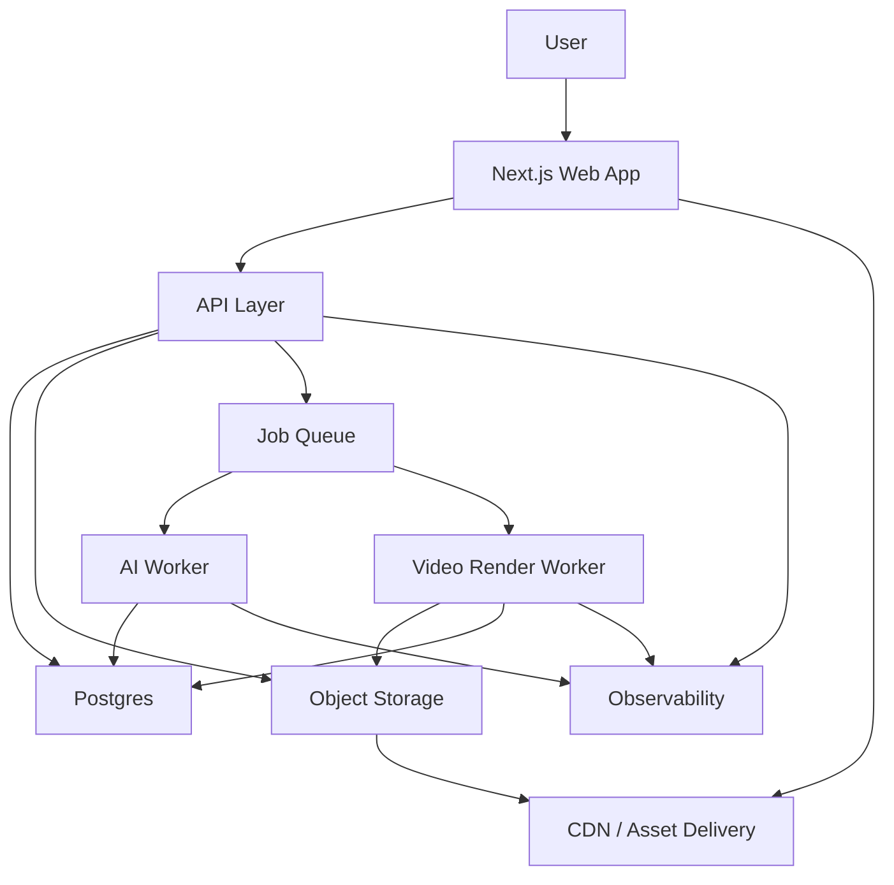

# CoachCast Production Cloud and CI/CD Plan

## Goal

CoachCast should be built as a production SaaS app, not a local demo.

Production means:

- source control in GitHub
- repeatable deployments
- separate preview, staging, and production environments
- managed secrets
- database backups
- object storage for video files
- background jobs for AI and rendering
- monitoring and error tracking
- rollback path
- CI checks before code reaches production

## Recommended Deployment Strategy

Use a phased cloud strategy.

### Phase A: MVP Production

Use managed services so we can ship quickly:

- Web app: Next.js on Vercel.
- Database: managed Postgres.
- File storage: S3-compatible object storage.
- Background jobs: managed job/queue provider or a small worker service.
- Auth: managed auth provider.
- CI/CD: GitHub Actions plus hosting-provider preview deployments.

Why:

- Fastest path from local app to production.
- Fewer infrastructure decisions while the product is still changing.
- Good for validating the core AI workflow.

### Phase B: Media Production

Move long video rendering into dedicated workers:

- Queue: SQS, Redis queue, or managed workflow engine.
- Worker runtime: container workers on AWS ECS/Fargate, AWS Batch, Cloud Run Jobs, or similar.
- Storage: object storage for raw uploads and rendered exports.
- CDN: serve final assets through a CDN.

Why:

- Video rendering is CPU-heavy and can run longer than serverless request limits.
- Workers need retries, progress, cancellation, and isolation.
- The web app should stay fast even when render jobs are slow.

### Phase C: Scale Production

When usage grows:

- Move all long-running jobs to dedicated workers.
- Add usage limits and billing.
- Add multi-workspace support.
- Add observability dashboards.
- Add platform publishing integrations.
- Add regional storage if needed.

## Production Architecture



## Environments

Use three deployment environments.

### Preview

Created for every pull request.

Purpose:

- test UI changes
- share work before merging
- run smoke checks

Data:

- mock data or isolated preview database

### Staging

Created from the `main` branch or a protected release branch.

Purpose:

- test production-like config
- validate migrations
- verify AI jobs and render workers

Data:

- staging database
- staging storage bucket
- staging API keys

### Production

Created only after CI passes and deployment is approved.

Purpose:

- real users
- real billing
- real storage
- real monitoring

Data:

- production database
- production storage bucket
- production secrets

## CI Pipeline

CI runs on every pull request.

Stages:

1. Install dependencies.
2. Check formatting.
3. Lint code.
4. Typecheck.
5. Run unit tests.
6. Run component tests.
7. Build production bundle.
8. Run accessibility/static checks where possible.
9. Upload artifacts if needed.

Why:

- Prevent broken code from reaching review.
- Catch type and build errors before deploy.
- Keep production deploys boring.

## CD Pipeline

CD runs after CI passes.

### Pull Request

Deploy preview environment.

Checks:

- preview URL created
- smoke test landing page
- smoke test app shell
- smoke test primary CTA

### Main Branch

Deploy staging.

Checks:

- run database migrations against staging
- smoke test app routes
- run one mocked AI workflow
- verify worker health endpoint

### Production Release

Deploy production after approval.

Checks:

- run migrations safely
- deploy web app
- deploy workers
- verify health checks
- verify background queue
- verify storage write/read
- verify monitoring is receiving events

## GitHub Actions Workflow Design

Do not add GitHub Actions until the project has:

- `package.json`
- test scripts
- build scripts
- deployment target
- environment variable list

First real workflows should be:

```text
.github/workflows/ci.yml
.github/workflows/preview.yml
.github/workflows/deploy-staging.yml
.github/workflows/deploy-production.yml
```

### `ci.yml`

Runs on:

- pull request
- push to main

Responsibilities:

- install
- lint
- typecheck
- test
- build
- build the production container image

Why:

- The app must be deployable from a clean machine, not only runnable on a developer laptop.
- A container build catches missing files, bad standalone output, and runtime assumptions before cloud deploy.

## Current Deployment Unit

The current app now has a portable web deployment unit:

- `Dockerfile` builds the Next.js standalone server.
- `.dockerignore` keeps local artifacts and secrets out of the image context.
- `/api/health` returns a no-cache runtime health response for cloud health checks.
- CI validates the container image after lint, typecheck, tests, and production build.

Local verification:

```bash
npm run docker:build
docker run --rm -p 3000:3000 coachcast:local
```

Health check:

```bash
curl http://localhost:3000/api/health
```

### `preview.yml`

Runs on:

- pull request

Responsibilities:

- deploy preview
- run browser smoke checks
- comment preview URL on PR

### `deploy-staging.yml`

Runs on:

- push to main

Responsibilities:

- deploy staging
- run staging migrations
- run staging smoke tests

### `deploy-production.yml`

Runs on:

- manual approval
- version tag

Responsibilities:

- deploy production
- run production smoke tests
- notify on success/failure

## Secrets Strategy

Never store secrets in source code.

Use:

- GitHub repository/environment secrets for CI.
- Hosting provider environment variables for app runtime.
- Cloud secret manager for workers and infrastructure.
- OIDC-based cloud auth where possible instead of long-lived deploy keys.

Secrets to plan for:

- database URL
- auth secret
- OpenAI API key
- storage access keys
- queue credentials
- render worker secret
- payment provider keys
- social OAuth credentials
- monitoring DSN

## Database Strategy

Use Postgres.

Why:

- reliable relational model
- good for SaaS workspaces
- good migration tooling
- supports analytics queries later

Initial tables:

- users
- workspaces
- brand_profiles
- content_ideas
- scripts
- recordings
- render_jobs
- published_assets
- ai_job_logs

Migration rules:

- every schema change is a migration
- migrations run in CI/staging before production
- production migrations must be backward-compatible when possible
- never manually edit production schema

## Storage Strategy

Use object storage for:

- raw uploaded videos
- extracted audio
- thumbnails
- rendered MP4 files
- captions
- brand assets

Rules:

- store files outside the database
- database stores metadata and object keys
- use signed upload URLs
- use signed download URLs for private assets
- keep separate buckets or prefixes per environment

## Background Jobs

Do not run video rendering inside normal web requests.

Use jobs for:

- brand scan
- script generation
- transcription
- render planning
- video rendering
- export packaging
- publishing

Job requirements:

- idempotency key
- retry policy
- timeout
- progress state
- error message
- cancellation support later

Why:

- AI and video work can fail or take time.
- Users need progress and recovery.
- Workers can scale separately from the web app.

## Observability

Production needs visibility from day one.

Track:

- frontend errors
- API errors
- AI job failures
- render failures
- queue depth
- latency
- failed logins
- storage errors
- deployment events

Minimum tools:

- error tracking
- structured logs
- uptime checks
- deployment notifications

## Security Controls

Minimum production controls:

- authentication
- workspace authorization
- private asset access
- input validation
- rate limits on AI endpoints
- upload size limits
- file type validation
- signed upload/download URLs
- no secrets in logs
- audit log for publish actions

AI-specific controls:

- store prompt version
- store output for debugging
- prevent unsafe fitness/medical claims
- require user approval before publishing
- treat website/social content as untrusted input

## Rollback Strategy

Every deployment should have a rollback plan.

Web app:

- redeploy previous build

Database:

- use backward-compatible migrations
- avoid destructive migrations in the same release as code changes

Workers:

- keep old worker image available
- pause queue if needed

Storage:

- do not delete source files automatically

## What Not To Build Yet

Do not build these before the app shell exists:

- Kubernetes
- complex Terraform modules
- multi-region infrastructure
- direct Instagram/TikTok publishing
- custom auth
- custom billing system
- advanced analytics warehouse

Why:

- These are real production needs later, but they would slow down the first product slice.

## Immediate Implementation Sequence

1. Convert the repo to Next.js + TypeScript.
2. Add `package.json` scripts:
   - `dev`
   - `lint`
   - `typecheck`
   - `test`
   - `build`
3. Add app routes with mocked data.
4. Add CI workflow for lint/typecheck/test/build.
5. Add preview deployment.
6. Add staging environment.
7. Add production deployment.
8. Add database and migrations.
9. Add storage.
10. Add AI job logging.
11. Add background workers.
12. Add real AI calls.
13. Add rendering worker.

## Current Decision

CoachCast should target a production SaaS architecture with a managed web deployment first and dedicated AI/video workers later.

The project is now past the static HTML stage: it has a Next.js app, CI gates, a health endpoint, and a container image path. The next deployment decision is the cloud target: Vercel for fastest web previews, or a container platform such as Cloud Run, Azure Container Apps, AWS ECS/Fargate, or Render for a portable runtime.

The first deploy path is documented in `docs/05-deployment-runbook.md`.
